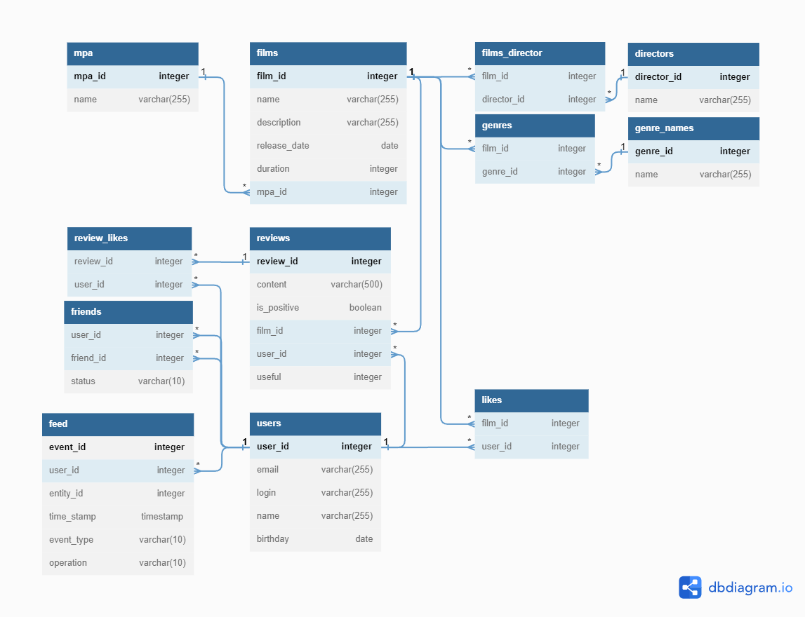

# Filmorate
Film rating app with user control

ER-diagram:
<picture>    
    
</picture>

Request examples:

Get names of user's confirmed friends:

```
SELECT name
FROM users
WHERE id IN (SELECT friend_id
             FROM friends
             WHERE user_id=request_id             
             AND status='confirmed'
             UNION
             SELECT user_id
             FROM friends
             WHERE friend_id=request_id)
             AND status='confirmed');
```
Get rating of all comedy:
```
SELECT name,
       rt.name
FROM films
JOIN ratings AS rt ON films.rating=rt.rating_id;
WHERE films.id IN (SELECT film_id
                   FROM genres
                   WHERE genre_id=(SELECT genre_id
                                   FROM genre_names
                                   WHERE name='comedy'))  
```